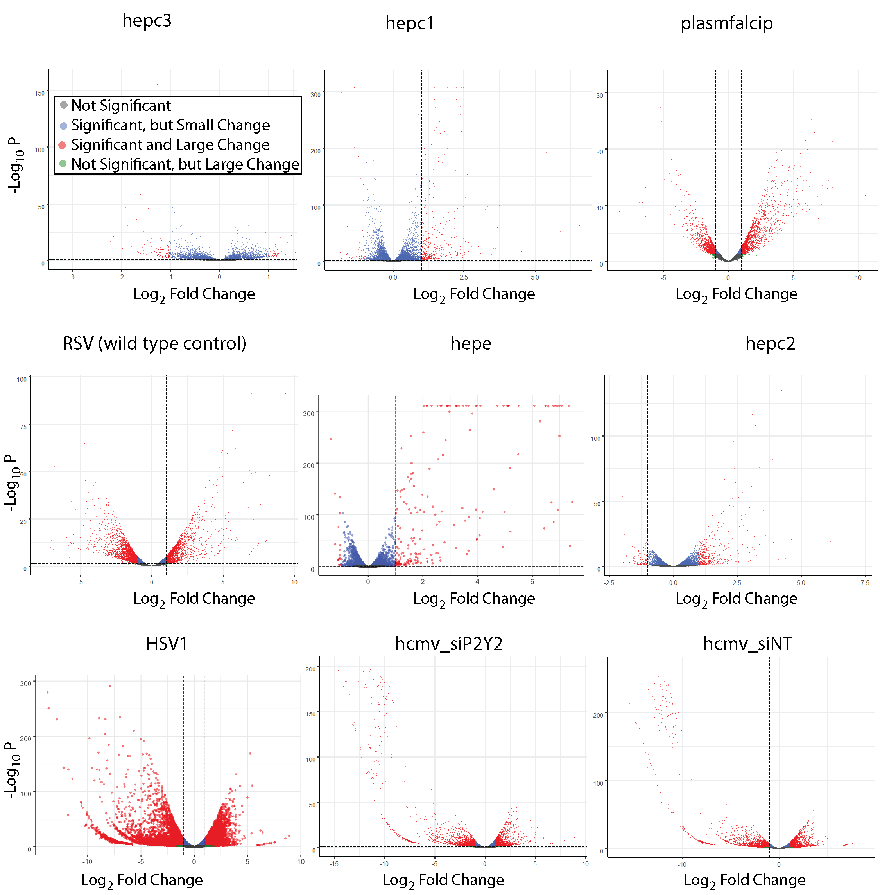

# ViraVate 
("vee-rah-vah-tey")
a.k.a. Virus Seer
 
# Why use ViraVate?

ViraVate is a command-line tool to identify whether differences between a user-provided gene expression matrix of any case vs. control (e.g. diabetics vs. non-diabetics) are associated with differentially expressed genes in infected vs. uninfected groups across a database of human-viral infections.

With ViraVate, you have a simple and fast solution to identify viral infection derived variants in data you already have. 

# How to set up ViraVate:


### Docker

ViraVate is powered with Docker. If you do not already have Docker installed, please install it with the [instructions here](https://docs.docker.com/install/).

### Installing ViraVate

1. Set up ViraVate Docker Container

Once you have Docker set up, run the following command:

```console
$ docker pull virushunter/base_viravate:latest
```

2. Clone the repository
<pre><code>git clone https://github.com/NCBI-Codeathons/Clinical-RNAseq.git
</code></pre>

3. Run viravate.sh with the three arguments (gene_expression_matrix, case_control_list, additional_gene_sets). The following example shows how to run ViraVate with: <br/>

gene_expression_matrix = "small_m.tsv" <br/>
case_control_list = "small_l.tsv" <br/>
additional_gene_sets= "cereda.158.KEGG.gmt" <br/>

Note that all these files must be in the same directory as viravate.sh.

```console
$ viravate.sh -e small_m.tsv -c small_l.tsv -g cereda.158.KEGG.gmt
```

### Configuration

# How to use ViraVate:

ViraVate takes inputs of (1) a gene expression matrix from a study containing two groups and (2) a key to indicate which data belongs to a ‘control’ versus the ‘experimental’ group.  The output of ViraVate is a list of the viral infection derived variants between the control and experimental groups.  


ViraVate requires two inputs from the user.  The first input is a gene expression matrix from a study containing two groups (Fig #).  The second input is a key to indicate which data belongs to a ‘control’ versus the ‘experimental’ group (Fig #).  While the author provided compilation of variants of interest, there is an optional input for the user to include additional genetic variants.

[] Fig. # <Image of an input gene expression matrix>
[] Fig. # <Image of an input group key>
 
 Running ViraVate is easily run with the following line(s) of code in <R?>:
 
<pre><code>This is a code block.
</code></pre>

The output of X will indicate significantly different viral infection derived variants between the control and experimental groups (Fig. #).

[] Fig. # <Image of output of ViraVate>

# Methods: Implimentation
# Results

ViraVate represents an infrastructure that allows researchers to determine if control and experimental groups have different viral infection derived variants.  Having clear genetic variants of interest will facilitate longitudinal studies that can methodologically quantify the association between viral infection and future health complications.

Using 10 infections cases we have first visualized all genes with volcano plots. Note the unique distributions across the 10 infections. Some infections result in a large and significant change in magnitude of gene expression.



Performing a PCA analysis on the genes that had a large and significant change in magnitude.  The first two components of the PCA analysis vidualized below.  Note that some infected and control groups are clearly separated, whereas other infected groups are not very different from the control groups. 


Heat maps of the top 50 genes from the first component of the  PCA analysis indicate that there are clear differences in gene expression between infected and controls for some (e.g., hep3, pasnfalcip) but not all infections. This could suggest that not all infections changes gene expression or that gene expression may only be changed in a subset of individuals.


# Additional Functionality? 

